<!-- GENERATED by architecture_maps/c4gen — do not hand-edit.
     Edit architecture_maps/models/mit-learn.yaml and re-run `python -m c4gen build`. -->
# Containers — MIT Learn

_Generated 2026-06-23 14:32 UTC · c4gen dev_

The runtime/deployable units inside **MIT Learn** and how data moves
between them and adjacent systems.

```mermaid
%%{init: {"c4": {"useMaxWidth": false, "wrap": true, "c4ShapeInRow": 3, "c4BoundaryInRow": 2, "c4ShapeMargin": 34, "c4ShapePadding": 18, "width": 275, "height": 72, "personFontSize": 16, "external_personFontSize": 16, "systemFontSize": 16, "system_extFontSize": 16, "containerFontSize": 15, "container_extFontSize": 15, "containerDbFontSize": 15, "containerQueueFontSize": 15, "boundaryFontSize": 16, "messageFontSize": 14}}}%%
C4Container
  title Container diagram — MIT Learn
  System_Boundary(mit_learn_b, "MIT Learn") {
    Container(nextjs, "Next.js Frontend", "Next.js App Router / React (Node 22)", "Server-rendered UI")
    Container(nginx, "Nginx", "Nginx", "Reverse proxy in front of Django")
    Container(django_web, "Django Web API", "Django + DRF (Granian/uWSGI, Python 3.12)", "REST API, auth, search orchestration, admin,…")
    Container(celery_edx, "Celery — edx_content queue", "Celery worker", "ETL ingestion of course/resource metadata and…")
    Container(celery_default, "Celery — default queue", "Celery worker", "Search indexing, subscription-digest email,…")
    Container(celery_embeddings, "Celery — embeddings queue", "Celery worker", "Generates vector embeddings for…")
    Container(beat, "Celery Beat (RedBeat)", "RedBeat (Redis-backed)", "Schedules periodic ETL, indexing, and…")
    ContainerDb(postgres, "PostgreSQL", "PostgreSQL 16 (RDS in prod)", "System of record for resources, users, lists,…")
    ContainerQueue(redis, "Redis / Valkey", "Redis 8 (ElastiCache Valkey in prod)", "Django cache, Celery broker/result backend,…")
    ContainerDb(opensearch, "OpenSearch", "OpenSearch", "Full-text search index over learning resources")
    Container(tika, "Apache Tika", "Tika 2.5 (sidecar)", "Extracts text from documents/content for…")
    Container(s3, "S3 App Storage", "AWS S3", "File/media storage for app assets and ETL…")
  }
  System_Ext(fastly, "Fastly CDN", "TLS termination, caching, and compression")
  System_Ext(apisix, "APISIX Gateway", "Shared API gateway enforcing OIDC")
  System_Ext(vault, "HashiCorp Vault", "Secrets and dynamic database credentials…")
  System_Ext(learn_ai, "learn-ai", "AI sidecar")
  System_Ext(qdrant, "Qdrant", "Externally hosted vector database for…")
  System_Ext(litellm, "LiteLLM Proxy", "OpenAI-compatible proxy fronting LLMs")
  System_Ext(mailgun, "Mailgun", "Transactional/digest email delivery")
  System_Ext(posthog, "PostHog", "Product analytics and feature flags")
  System_Ext(mitxonline, "MITx Online", "MITx Online course/enrollment platform")
  System_Ext(micromasters, "MicroMasters", "MicroMasters program platform")
  System_Ext(data_platform, "OL Data Platform (Dagster / Hightouch)", "Dagster pipelines POST content webhooks")
  System_Ext(course_apis, "External Course REST APIs", "edX, MIT Professional Ed, Sloan Executive Ed,…")
  System_Ext(content_archives, "S3 Content Archives", "edX/xPRO/xOnline/Canvas OLX & .imscc, OCW…")
  System_Ext(media_feeds, "Media & News Feeds", "YouTube Data API, podcast RSS, Medium RSS, OL…")
  Rel(fastly, nextjs, "Frontend traffic", "HTTPS")
  Rel(fastly, apisix, "API traffic", "HTTPS")
  Rel(nextjs, apisix, "Server/client API calls", "HTTPS/JSON")
  Rel(apisix, nginx, "Proxy authenticated request", "HTTP")
  Rel(nginx, django_web, "Forward request", "WSGI/HTTP")
  Rel(django_web, postgres, "Read/write", "SQL")
  Rel(django_web, redis, "Cache + enqueue tasks", "Redis")
  Rel(django_web, opensearch, "Search query", "HTTPS")
  Rel(django_web, qdrant, "Vector search", "HTTPS")
  Rel(django_web, s3, "Store/serve files", "HTTPS")
  Rel(django_web, posthog, "Events + feature flags", "HTTPS")
  Rel(vault, django_web, "Secrets + dynamic DB creds", "HTTPS")
  Rel(apisix, learn_ai, "Proxy /ai/* (OIDC)", "HTTPS")
  Rel(learn_ai, django_web, "Vector/syllabus search (tool calls)", "HTTPS")
  Rel(learn_ai, litellm, "LLM completions", "HTTPS")
  Rel(beat, redis, "Schedule periodic tasks", "async · Redis")
  Rel(celery_edx, mitxonline, "Pull course/program catalog", "async · REST")
  Rel(celery_edx, micromasters, "Pull catalog + Wagtail pages", "async · REST")
  Rel(celery_edx, course_apis, "Fetch REST catalogs", "async · REST/OAuth2")
  Rel(celery_edx, content_archives, "Fetch S3 archives", "async · S3")
  Rel(celery_default, media_feeds, "Fetch feeds + scrape", "async · RSS/REST/scrape")
  Rel(celery_edx, tika, "Extract text", "async · HTTP")
  Rel(celery_default, opensearch, "Index resources", "async · HTTPS")
  Rel(celery_embeddings, postgres, "Read resources to embed", "async · SQL")
  Rel(celery_embeddings, qdrant, "Upsert vectors", "async · HTTPS")
  Rel(celery_embeddings, litellm, "Embeddings (if QDRANT_ENCODER=litellm)", "async · HTTPS")
  Rel(celery_default, mailgun, "Subscription digest emails", "async · HTTPS")
  Rel(data_platform, django_web, "Content webhooks (HMAC)", "async · HTTPS")
  Rel(data_platform, postgres, "Reverse-ETL write (Hightouch)", "async · SQL")
  UpdateRelStyle(beat, redis, $textColor="#e8a33d", $lineColor="#e8a33d")
  UpdateRelStyle(celery_edx, mitxonline, $textColor="#e8a33d", $lineColor="#e8a33d")
  UpdateRelStyle(celery_edx, micromasters, $textColor="#e8a33d", $lineColor="#e8a33d")
  UpdateRelStyle(celery_edx, course_apis, $textColor="#e8a33d", $lineColor="#e8a33d")
  UpdateRelStyle(celery_edx, content_archives, $textColor="#e8a33d", $lineColor="#e8a33d")
  UpdateRelStyle(celery_default, media_feeds, $textColor="#e8a33d", $lineColor="#e8a33d")
  UpdateRelStyle(celery_edx, tika, $textColor="#e8a33d", $lineColor="#e8a33d")
  UpdateRelStyle(celery_default, opensearch, $textColor="#e8a33d", $lineColor="#e8a33d")
  UpdateRelStyle(celery_embeddings, postgres, $textColor="#e8a33d", $lineColor="#e8a33d")
  UpdateRelStyle(celery_embeddings, qdrant, $textColor="#e8a33d", $lineColor="#e8a33d")
  UpdateRelStyle(celery_embeddings, litellm, $textColor="#e8a33d", $lineColor="#e8a33d")
  UpdateRelStyle(celery_default, mailgun, $textColor="#e8a33d", $lineColor="#e8a33d")
  UpdateRelStyle(data_platform, django_web, $textColor="#e8a33d", $lineColor="#e8a33d")
  UpdateRelStyle(data_platform, postgres, $textColor="#e8a33d", $lineColor="#e8a33d")
  UpdateLayoutConfig($c4ShapeInRow="3", $c4BoundaryInRow="1")
```

## Containers

| Container | Technology | Responsibility |
| --- | --- | --- |
| **Next.js Frontend** | Next.js App Router / React (Node 22) | Server-rendered UI. Calls the API both server-side (SSR/RSC prefetch) and from the browser via NEXT_PUBLIC_MITOL_API_BASE_URL. |
| **Nginx** | Nginx | Reverse proxy in front of Django; serves static assets. |
| **Django Web API** | Django + DRF (Granian/uWSGI, Python 3.12) | REST API, auth, search orchestration, admin, webhooks, vector-search endpoints. |
| **Celery — edx_content queue** | Celery worker | ETL ingestion of course/resource metadata and content files from providers. |
| **Celery — default queue** | Celery worker | Search indexing, subscription-digest email, feeds/scrapes, housekeeping. |
| **Celery — embeddings queue** | Celery worker | Generates vector embeddings for semantic/vector search. |
| **Celery Beat (RedBeat)** | RedBeat (Redis-backed) | Schedules periodic ETL, indexing, and embedding tasks. Runs embedded in the worker (-B) locally; split out in production. |
| **PostgreSQL** | PostgreSQL 16 (RDS in prod) | System of record for resources, users, lists, and editorial data. |
| **Redis / Valkey** | Redis 8 (ElastiCache Valkey in prod) | Django cache, Celery broker/result backend, and RedBeat schedule store. |
| **OpenSearch** | OpenSearch | Full-text search index over learning resources (alias-swapped reindex). |
| **Apache Tika** | Tika 2.5 (sidecar) | Extracts text from documents/content for indexing and embeddings. |
| **S3 App Storage** | AWS S3 | File/media storage for app assets and ETL artifacts. |
