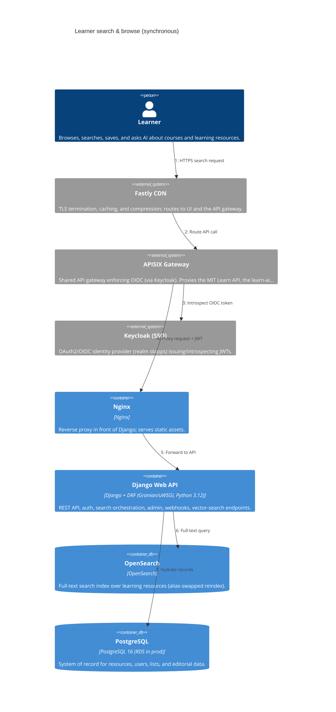
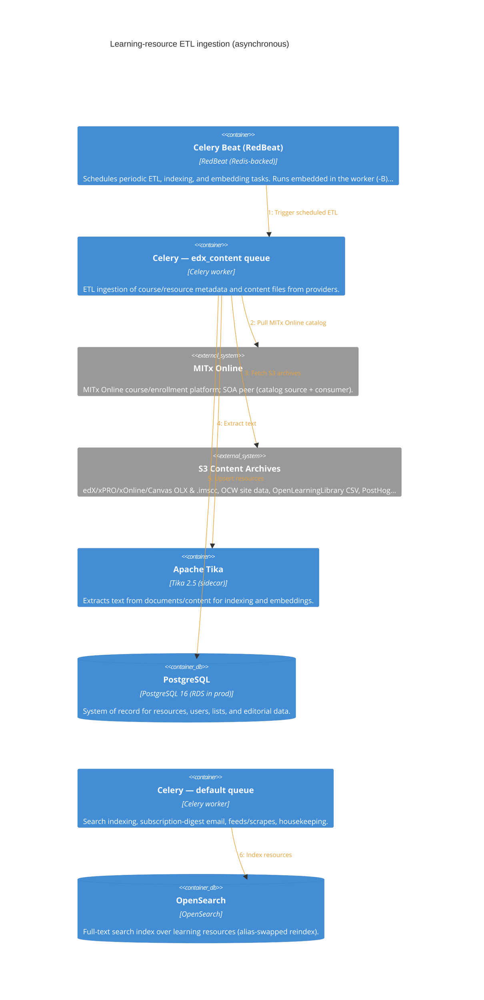
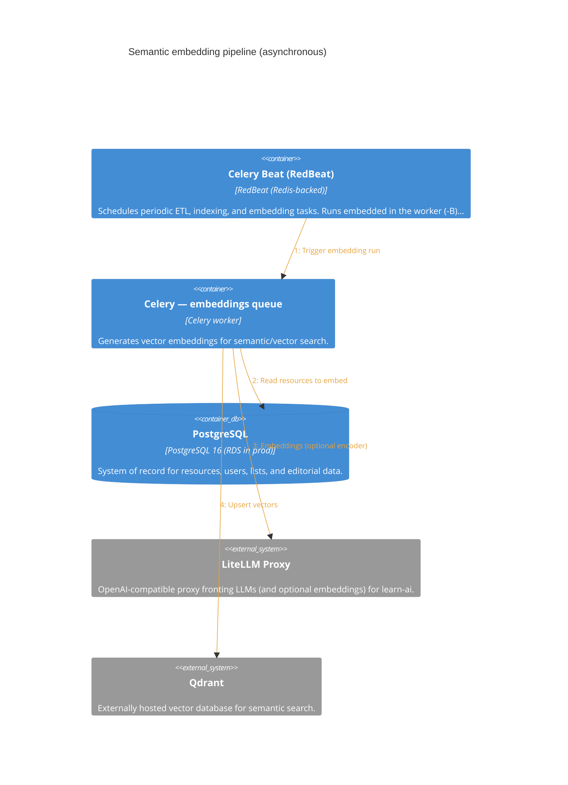
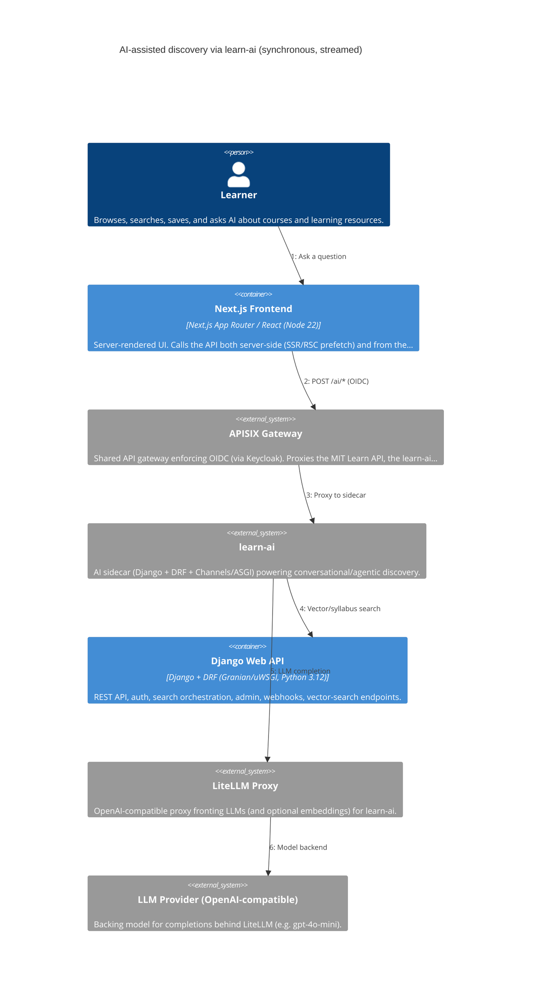
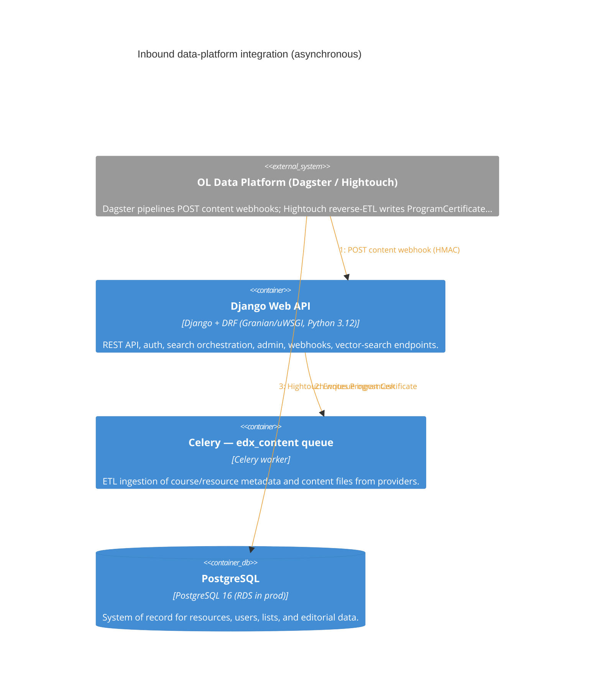

<!-- GENERATED by architecture_maps/c4gen — do not hand-edit.
     Edit architecture_maps/models/mit-learn.yaml and re-run `python -m c4gen build`. -->
# Data Flows — MIT Learn

_Generated 2026-06-22 21:40 UTC · c4gen dev_

Each scenario below replays one interaction as a C4 **Dynamic** diagram.
Amber steps are asynchronous (queued / scheduled / event-driven).

!!! info "How to read these diagrams"
    These are [C4 model](https://c4model.com/) diagrams rendered with
    [Mermaid C4](https://mermaid.js.org/syntax/c4.html). Read them top-down:
    **System Context** (the whole SOA) → **Container** (one system's runtime
    units) → **Dynamic** (a single data flow, step by step).

    * **People** are rounded boxes; **systems** and **containers** are
      rectangles; **databases** and **queues** have distinct shapes.
    * Each arrow is a data flow labelled with *what* moves and *how*.
    * **Blue / solid-tone arrows** are
      **synchronous** (request/response, caller blocks).
    * **Amber arrows** (technology
      prefixed `async ·`) are **asynchronous** (queued, scheduled, or
      event-driven — caller does not block).

## Learner search & browse (synchronous)

The synchronous request path. The learner hits Fastly, which routes API calls through the APISIX gateway (authenticated by Keycloak) to Django, which queries OpenSearch and Postgres and returns results. Next.js also performs this server-side during SSR/RSC prefetch.

## Learning-resource ETL ingestion (asynchronous)

Celery Beat schedules ETL. The edx_content worker pulls catalogs from SOA peers and external APIs, fetches content archives from S3, extracts text via Tika, and upserts to Postgres; the default worker then indexes OpenSearch.

## Semantic embedding pipeline (asynchronous)

Roughly every 30 minutes the embeddings worker reads new/changed resources and upserts vectors into Qdrant. The default encoder is **local** (Gensim/sklearn); the dashed LiteLLM step only runs when QDRANT_ENCODER=litellm.

## AI-assisted discovery via learn-ai (synchronous, streamed)

The frontend calls the learn-ai service through APISIX. learn-ai pulls resource context from MIT Learn's vector-search API and calls an LLM via the LiteLLM proxy, streaming the answer back.

## Inbound data-platform integration (asynchronous)

The OL data platform integrates two ways: Dagster pipelines POST HMAC-signed content webhooks that enqueue ingestion, and Hightouch reverse-ETL writes ProgramCertificate rows directly into Postgres over the public DB endpoint.

## Ingestion sources (ETL)

Every external source the `edx_content` / `default` Celery workers pull from, with transport and cadence. ⚠️ marks brittle linkages (HTML/token scrapes, hardcoded URLs).

| Source | Transport | Cadence | Data | Source of truth |
| --- | --- | --- | --- | --- |
| **Canvas** | S3 .imscc archives | weekly Sun 05:00 | courses | `learning_resources/etl/tasks.py:619` |
| ⚠️ **MIT Climate** | REST JSON feed (hardcoded URL) | daily 05:30 | articles | `learning_resources/etl/tasks.py:171` |
| **MIT OpenCourseWare** | S3 JSON site data | webhook / on-demand | OCW courses | `learning_resources/etl/tasks.py:414` |
| **MIT Professional Ed** | REST Drupal feeds JSON | daily 21:00 | courses | `learning_resources/etl/tasks.py:147` |
| **MITx Online (catalog)** | REST JSON paginated | every 6h | courses + programs | `learning_resources/etl/mitxonline.py:154` |
| **MITx Online (content files)** | S3 | daily 07:00 | content | `learning_resources/etl/tasks.py:276` |
| ⚠️ **Marketing pages** | HTML scrape → markdown | every 12h | marketing text | `learning_resources/etl/tasks.py:671` |
| ⚠️ **Medium (news)** | RSS feedparser (hardcoded URL) | every 3h | blog posts | `news_events/etl/medium_mit_news.py` |
| **MicroMasters** | REST JSON | daily 05:00 | programs + Wagtail pages | `learning_resources/etl/tasks.py:82` |
| **ODL Video Service** | public REST JSON | daily 09:00 | videos + transcripts | `learning_resources/etl/tasks.py:342` |
| ⚠️ **OL events** | REST Drupal JSON:API (hardcoded URL) | every 3h | events | `news_events/tasks.py:16` |
| **Open Learning Library** | CSV via Google Sheets export | scheduled | metadata | `learning_resources/etl/oll.py:56` |
| ⚠️ **Podcasts (RSS)** | per-podcast RSS + GitHub config | daily 06:00/23:00 | podcast episodes | `learning_resources/etl/podcast.py` |
| ⚠️ **PostHog views** | S3 Parquet event files | every 3h | resource view counts | `learning_resources/etl/tasks.py:541` |
| **Sloan Executive Ed** | REST OAuth2-JWT | daily 04:30 | courses | `learning_resources/etl/tasks.py:154` |
| ⚠️ **Sloan exec news/webinars** | Salesforce Aura POST (token-scraped) | every 3h | news + webinars | `news_events/etl/sloan_exec_news.py:73` |
| **YouTube** | YouTube Data API + GitHub YAML config | daily 08:30 | videos + transcripts | `learning_resources/etl/tasks.py:479` |
| **edX (catalog)** | REST OAuth2-JWT | daily 05:00 | course + program catalog | `learning_resources/etl/tasks.py:96` |
| **edX (content files)** | S3 OLX archives | daily 06:00 | OLX content | `learning_resources/etl/tasks.py:246` |
| **xPRO (catalog)** | REST JSON | daily 05:00 | catalog | `learning_resources/etl/tasks.py:162` |
| **xPRO / xOnline (files)** | S3 | daily 08:00 | content | `learning_resources/etl/tasks.py:292` |
