<!-- GENERATED by architecture_maps/c4gen — do not hand-edit.
     Edit architecture_maps/models/mit-learn.yaml and re-run `python -m c4gen build`. -->
# System Context — MIT Learn

_Generated 2026-06-23 13:51 UTC · c4gen dev_

The widest view: **MIT Learn** and every external actor and system it
exchanges data with. Edges shown are **curated and code-verified**; raw
graph-derived candidates are listed under
[Dependencies & Cycles](dependencies-and-cycles.md).

```mermaid
%%{init: {"c4": {"useMaxWidth": false, "c4ShapeInRow": 3, "c4BoundaryInRow": 2, "c4ShapeMargin": 30, "c4ShapePadding": 18, "width": 240, "height": 70, "personFontSize": 16, "external_personFontSize": 16, "systemFontSize": 16, "system_extFontSize": 16, "containerFontSize": 15, "container_extFontSize": 15, "containerDbFontSize": 15, "containerQueueFontSize": 15, "boundaryFontSize": 16, "messageFontSize": 14}}}%%
C4Context
  title System Context — MIT Learn
  Person(learner, "Learner", "Browses, searches, saves, and asks AI about courses and learning resources.")
  System(mit_learn, "MIT Learn", "Course & learning-resource discovery platform (Django API + Next.js UI).")
  System_Ext(fastly, "Fastly CDN", "TLS termination, caching, and compression; routes to UI and the API gateway.")
  System_Ext(apisix, "APISIX Gateway", "Shared API gateway enforcing OIDC (via Keycloak). Proxies the MIT Learn API, the learn-ai…")
  System_Ext(keycloak, "Keycloak (SSO)", "OAuth2/OIDC identity provider (realm olapps) issuing/introspecting JWTs.")
  System_Ext(vault, "HashiCorp Vault", "Secrets and dynamic database credentials injected at runtime.")
  System_Ext(learn_ai, "learn-ai", "AI sidecar (Django + DRF + Channels/ASGI) powering conversational/agentic discovery.")
  System_Ext(qdrant, "Qdrant", "Externally hosted vector database for semantic search.")
  System_Ext(litellm, "LiteLLM Proxy", "OpenAI-compatible proxy fronting LLMs (and optional embeddings) for learn-ai.")
  System_Ext(openai, "LLM Provider (OpenAI-compatible)", "Backing model for completions behind LiteLLM (e.g. gpt-4o-mini).")
  System_Ext(mailgun, "Mailgun", "Transactional/digest email delivery (via anymail).")
  System_Ext(posthog, "PostHog", "Product analytics and feature flags; exports raw events to S3 (Parquet).")
  System_Ext(mitxonline, "MITx Online", "MITx Online course/enrollment platform; SOA peer (catalog source + consumer).")
  System_Ext(micromasters, "MicroMasters", "MicroMasters program platform; SOA peer (catalog + Wagtail pages source).")
  System_Ext(data_platform, "OL Data Platform (Dagster / Hightouch)", "Dagster pipelines POST content webhooks; Hightouch reverse-ETL writes ProgramCertificate…")
  System_Ext(course_apis, "External Course REST APIs", "edX, MIT Professional Ed, Sloan Executive Ed, MIT Climate, ODL Video.")
  System_Ext(content_archives, "S3 Content Archives", "edX/xPRO/xOnline/Canvas OLX & .imscc, OCW site data, OpenLearningLibrary CSV, PostHog…")
  System_Ext(media_feeds, "Media & News Feeds", "YouTube Data API, podcast RSS, Medium RSS, OL events (Drupal), Sloan Aura, marketing…")
  Rel(learner, fastly, "Browse / search", "HTTPS")
  Rel(fastly, mit_learn, "Frontend traffic", "HTTPS")
  Rel(fastly, apisix, "API traffic", "HTTPS")
  Rel(mit_learn, apisix, "Server/client API calls", "HTTPS/JSON")
  Rel(apisix, keycloak, "Authenticate (OIDC)", "OIDC")
  Rel(apisix, mit_learn, "Proxy authenticated request", "HTTP")
  Rel(mit_learn, qdrant, "Vector search", "HTTPS")
  Rel(mit_learn, posthog, "Events + feature flags", "HTTPS")
  Rel(vault, mit_learn, "Secrets + dynamic DB creds", "HTTPS")
  Rel(apisix, learn_ai, "Proxy /ai/* (OIDC)", "HTTPS")
  Rel(learn_ai, mit_learn, "Vector/syllabus search (tool calls)", "HTTPS")
  Rel(learn_ai, litellm, "LLM completions", "HTTPS")
  Rel(litellm, openai, "Model backend", "HTTPS")
  Rel(mit_learn, mitxonline, "Pull course/program catalog", "async · REST")
  Rel(mit_learn, micromasters, "Pull catalog + Wagtail pages", "async · REST")
  Rel(mit_learn, course_apis, "Fetch REST catalogs", "async · REST/OAuth2")
  Rel(mit_learn, content_archives, "Fetch S3 archives", "async · S3")
  Rel(mit_learn, media_feeds, "Fetch feeds + scrape", "async · RSS/REST/scrape")
  Rel(mit_learn, litellm, "Embeddings (if QDRANT_ENCODER=litellm)", "async · HTTPS")
  Rel(mit_learn, mailgun, "Subscription digest emails", "async · HTTPS")
  Rel(data_platform, mit_learn, "Content webhooks (HMAC)", "async · HTTPS")
  UpdateRelStyle(mit_learn, mitxonline, $textColor="#e8a33d", $lineColor="#e8a33d")
  UpdateRelStyle(mit_learn, micromasters, $textColor="#e8a33d", $lineColor="#e8a33d")
  UpdateRelStyle(mit_learn, course_apis, $textColor="#e8a33d", $lineColor="#e8a33d")
  UpdateRelStyle(mit_learn, content_archives, $textColor="#e8a33d", $lineColor="#e8a33d")
  UpdateRelStyle(mit_learn, media_feeds, $textColor="#e8a33d", $lineColor="#e8a33d")
  UpdateRelStyle(mit_learn, litellm, $textColor="#e8a33d", $lineColor="#e8a33d")
  UpdateRelStyle(mit_learn, mailgun, $textColor="#e8a33d", $lineColor="#e8a33d")
  UpdateRelStyle(data_platform, mit_learn, $textColor="#e8a33d", $lineColor="#e8a33d")
  UpdateLayoutConfig($c4ShapeInRow="3", $c4BoundaryInRow="2")
```

## External systems & peers

| System | Role |
| --- | --- |
| **Fastly CDN** | TLS termination, caching, and compression; routes to UI and the API gateway. |
| **APISIX Gateway** | Shared API gateway enforcing OIDC (via Keycloak). Proxies the MIT Learn API, the learn-ai service (/ai/*), and MITx Online (/mitxonline/*). |
| **Keycloak (SSO)** | OAuth2/OIDC identity provider (realm olapps) issuing/introspecting JWTs. |
| **HashiCorp Vault** | Secrets and dynamic database credentials injected at runtime. |
| **learn-ai** | AI sidecar (Django + DRF + Channels/ASGI) powering conversational/agentic discovery. |
| **Qdrant** | Externally hosted vector database for semantic search. |
| **LiteLLM Proxy** | OpenAI-compatible proxy fronting LLMs (and optional embeddings) for learn-ai. |
| **LLM Provider (OpenAI-compatible)** | Backing model for completions behind LiteLLM (e.g. gpt-4o-mini). |
| **Mailgun** | Transactional/digest email delivery (via anymail). |
| **PostHog** | Product analytics and feature flags; exports raw events to S3 (Parquet). |
| **MITx Online** | MITx Online course/enrollment platform; SOA peer (catalog source + consumer). |
| **MicroMasters** | MicroMasters program platform; SOA peer (catalog + Wagtail pages source). |
| **OL Data Platform (Dagster / Hightouch)** | Dagster pipelines POST content webhooks; Hightouch reverse-ETL writes ProgramCertificate rows directly into MIT Learn's Postgres. |
| **External Course REST APIs** | edX, MIT Professional Ed, Sloan Executive Ed, MIT Climate, ODL Video. |
| **S3 Content Archives** | edX/xPRO/xOnline/Canvas OLX & .imscc, OCW site data, OpenLearningLibrary CSV, PostHog Parquet. |
| **Media & News Feeds** | YouTube Data API, podcast RSS, Medium RSS, OL events (Drupal), Sloan Aura, marketing pages. |
