# MIT Learn Service Architecture Diagram

This document shows all services, components, and infrastructure for the MIT Learn project through a series of focused diagrams.

## 1. High-Level Architecture Overview

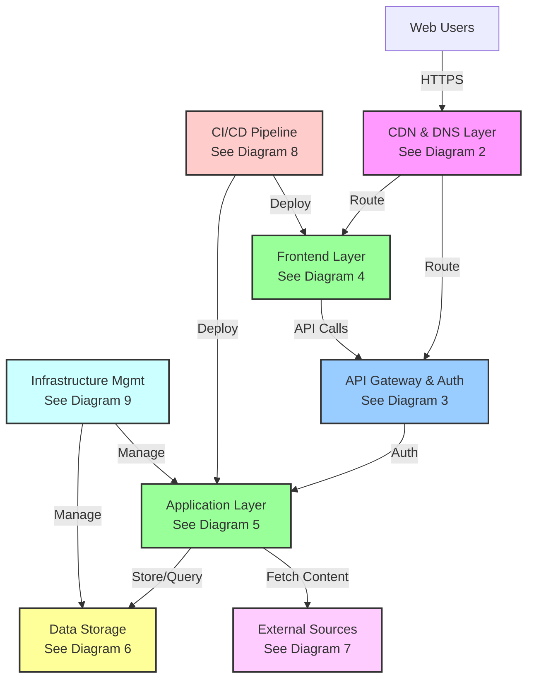

---

## 2. CDN & DNS Layer

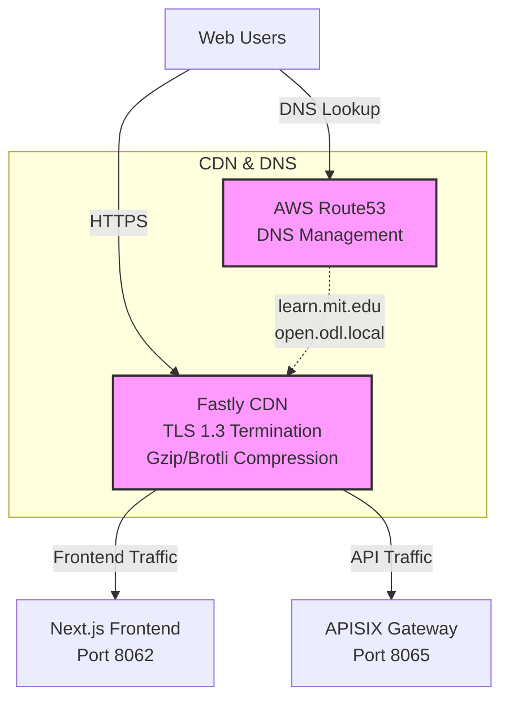

**Infrastructure Links:**
- Route53: [ol-infrastructure/.../mit_learn/__main__.py:949](https://github.com/mitodl/ol-infrastructure/blob/main/src/ol_infrastructure/applications/mit_learn/__main__.py#L949)
- Fastly CDN: [ol-infrastructure/.../mit_learn/__main__.py:802](https://github.com/mitodl/ol-infrastructure/blob/main/src/ol_infrastructure/applications/mit_learn/__main__.py#L802)

---

## 3. API Gateway & Authentication

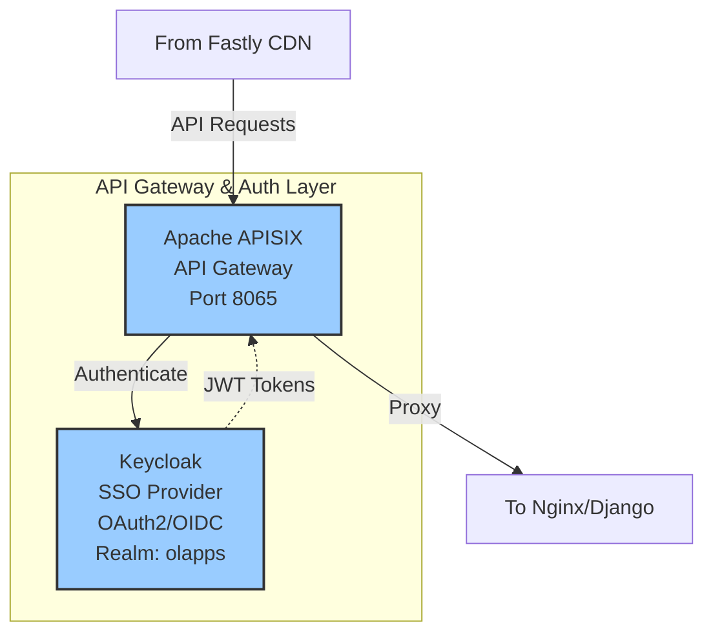

**Infrastructure Links:**
- APISIX: [ol-infrastructure/.../mit_learn/__main__.py:1200](https://github.com/mitodl/ol-infrastructure/blob/main/src/ol_infrastructure/applications/mit_learn/__main__.py#L1200)
- Keycloak: [ol-infrastructure/.../mit_learn/__main__.py:1224](https://github.com/mitodl/ol-infrastructure/blob/main/src/ol_infrastructure/applications/mit_learn/__main__.py#L1224)
- Local: [docker-compose.services.yml:96](https://github.com/mitodl/mit-learn/blob/main/docker-compose.services.yml#L96)

---

## 4. Frontend Layer (Kubernetes)

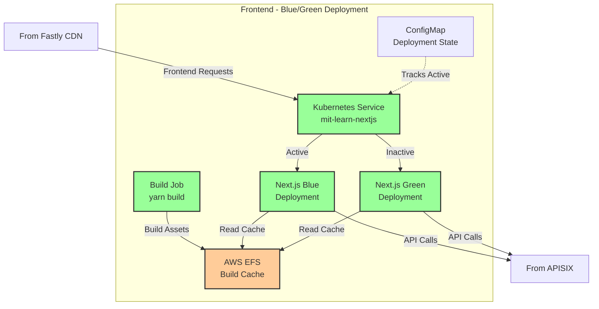

**Details:**
- **Node Version:** 22.21
- **Blue/Green Toggle:** Auto-toggle enabled by default
- **Build Process:** K8s Job runs `yarn build`, stores to EFS
- **Service Routing:** Points to active deployment (blue or green)

**Infrastructure Links:**
- Next.js App: [ol-infrastructure/.../mit_learn_nextjs/__main__.py](https://github.com/mitodl/ol-infrastructure/blob/main/src/ol_infrastructure/applications/mit_learn_nextjs/__main__.py)
- Build Job: [ol-infrastructure/.../mit_learn_nextjs/__main__.py:192](https://github.com/mitodl/ol-infrastructure/blob/main/src/ol_infrastructure/applications/mit_learn_nextjs/__main__.py#L192)
- EFS Storage: [ol-infrastructure/.../mit_learn_nextjs/__main__.py:166](https://github.com/mitodl/ol-infrastructure/blob/main/src/ol_infrastructure/applications/mit_learn_nextjs/__main__.py#L166)
- Local: [docker-compose.apps.yml:30](https://github.com/mitodl/mit-learn/blob/main/docker-compose.apps.yml#L30)

---

## 5. Application Layer (Kubernetes)

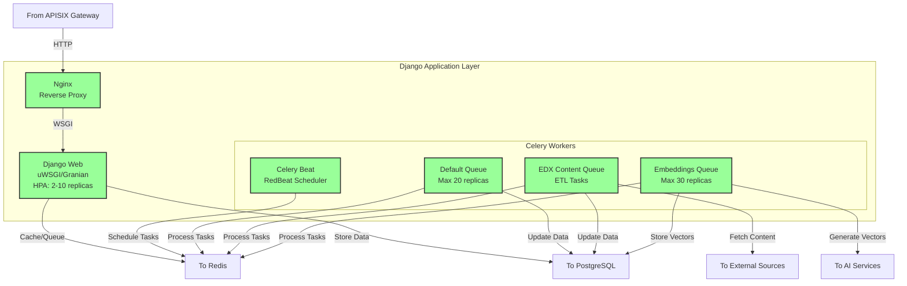

**Details:**
- **Python Version:** 3.12
- **Web Server:** uWSGI or Granian (configurable)
- **Autoscaling:** CPU (60%) and Memory (80%) based
- **Celery Queues:**
  - **default:** General background tasks
  - **edx_content:** ETL from external course providers
  - **embeddings:** AI vector generation (120min schedule)

**Infrastructure Links:**
- Django App: [ol-infrastructure/.../mit_learn/__main__.py:1417](https://github.com/mitodl/ol-infrastructure/blob/main/src/ol_infrastructure/applications/mit_learn/__main__.py#L1417)
- Celery Workers: [ol-infrastructure/.../mit_learn/__main__.py:1443](https://github.com/mitodl/ol-infrastructure/blob/main/src/ol_infrastructure/applications/mit_learn/__main__.py#L1443)
- Local: [docker-compose.apps.yml:5](https://github.com/mitodl/mit-learn/blob/main/docker-compose.apps.yml#L5)

---

## 6. Data Storage Layer

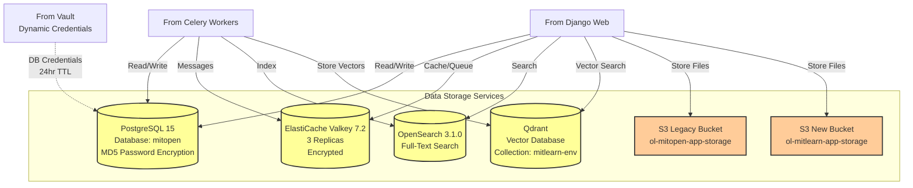

**Details:**
- **PostgreSQL:** Public access enabled for Hightouch/Airbyte integrations
- **Redis:** Cluster mode disabled, encryption at rest and in transit
- **OpenSearch:** 2 shards, 2 replicas
- **Qdrant:** Hosted externally, uses text-embedding-3-large (3072 dimensions)
- **S3:** Both buckets have public read access

**Infrastructure Links:**
- PostgreSQL: [ol-infrastructure/.../mit_learn/__main__.py:517](https://github.com/mitodl/ol-infrastructure/blob/main/src/ol_infrastructure/applications/mit_learn/__main__.py#L517)
- Valkey/Redis: [ol-infrastructure/.../mit_learn/__main__.py:1348](https://github.com/mitodl/ol-infrastructure/blob/main/src/ol_infrastructure/applications/mit_learn/__main__.py#L1348)
- OpenSearch: [ol-infrastructure/.../aws/opensearch/__main__.py](https://github.com/mitodl/ol-infrastructure/blob/main/src/ol_infrastructure/infrastructure/aws/opensearch/__main__.py)
- S3 Buckets: [ol-infrastructure/.../mit_learn/__main__.py:145](https://github.com/mitodl/ol-infrastructure/blob/main/src/ol_infrastructure/applications/mit_learn/__main__.py#L145)
- Local: [docker-compose.services.yml:10](https://github.com/mitodl/mit-learn/blob/main/docker-compose.services.yml#L10)

---

## 7. External Integrations & Services

### 7a. External Content Sources (ETL)

```mermaid
graph TB
    Celery[Celery EDX Content Queue]

    subgraph MIT["MIT Course Sources"]
        XPRO[MIT xPRO<br/>xpro.mit.edu/api]
        XOnline[MIT xOnline<br/>S3: mitx-etl-mitxonline]
        PE[MIT Professional Ed<br/>professional.mit.edu]
        SEE[Sloan Executive Ed<br/>executive.mit.edu]
        CSAIL[MIT CSAIL<br/>cap.csail.mit.edu]
        ProLearn[MIT ProLearn<br/>prolearn.mit.edu/graphql]
    end

    subgraph OpenContent["Open Content Sources"]
        OCW[MIT OCW<br/>ocw.mit.edu<br/>S3: ocw-content-storage]
        EDX[edX Platform<br/>api.edx.org]
        OLL[OpenLearningLibrary<br/>S3: ol-data-lake]
        MicroMasters[MicroMasters<br/>micromasters.mit.edu/api]
        YouTube[YouTube API<br/>Video Content]
    end

    Celery -->|Fetch Courses| XPRO
    Celery -->|Fetch Courses| XOnline
    Celery -->|Fetch Courses| PE
    Celery -->|Fetch Courses| SEE
    Celery -->|Fetch Courses| CSAIL
    Celery -->|Fetch Courses| ProLearn
    Celery -->|Fetch Courses| OCW
    Celery -->|Fetch Courses| EDX
    Celery -->|Fetch Courses| OLL
    Celery -->|Fetch Courses| MicroMasters
    Celery -->|Fetch Videos| YouTube

    style XPRO fill:#fcf,stroke:#333,stroke-width:2px
    style XOnline fill:#fcf,stroke:#333,stroke-width:2px
    style OCW fill:#fcf,stroke:#333,stroke-width:2px
    style EDX fill:#fcf,stroke:#333,stroke-width:2px
```

**ETL Schedule:**
- Most sources: Daily or hourly
- YouTube: Every 14400s (4 hours) for videos, 21600s (6 hours) for transcripts
- Embeddings: Every 120 minutes

### 7b. Supporting External Services

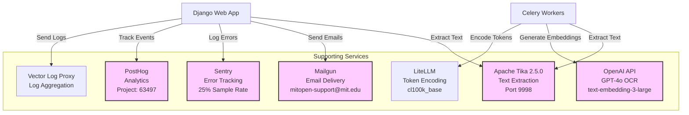

**Local Service:**
- Tika: [docker-compose.services.yml:67](https://github.com/mitodl/mit-learn/blob/main/docker-compose.services.yml#L67)

---

## 8. CI/CD Pipeline (Concourse)

### 8a. Backend Pipeline: mit-learn

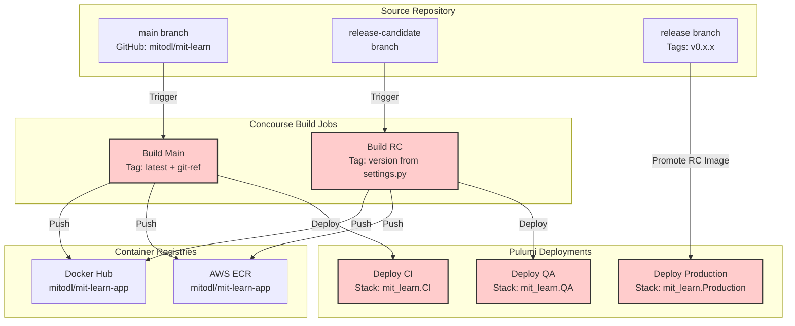

**Pipeline Details:**
- **Dockerfile:** `./Dockerfile` (root of repository)
- **Version Extraction:** `grep VERSION main/settings.py`
- **Environment Variables:** `MIT_LEARN_DOCKER_TAG` injected into Pulumi

### 8b. Frontend Pipeline: mit-learn-nextjs

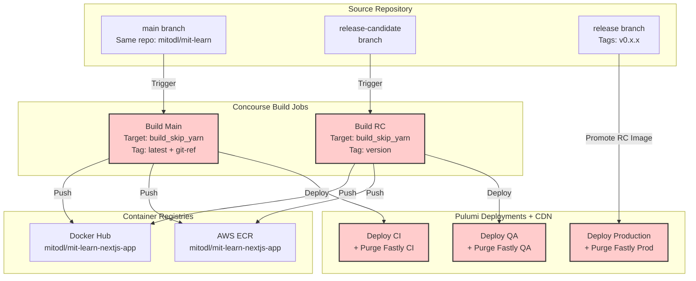

**Pipeline Details:**
- **Dockerfile:** `frontends/main/Dockerfile.web`
- **Build Target:** `build_skip_yarn`
- **Post-Deploy:** Fastly cache purge for immediate effect
- **Environment Variables:** `MIT_LEARN_NEXTJS_DOCKER_TAG` injected into Pulumi

**Infrastructure Links:**
- Pipeline Definition: [ol-infrastructure/.../k8s_apps/docker_pulumi.py](https://github.com/mitodl/ol-infrastructure/blob/main/src/ol_concourse/pipelines/infrastructure/k8s_apps/docker_pulumi.py)
- Meta Pipeline: [ol-infrastructure/.../k8s_apps/meta.py:118](https://github.com/mitodl/ol-infrastructure/blob/main/src/ol_concourse/pipelines/infrastructure/k8s_apps/meta.py#L118)

---

## 9. Infrastructure Management

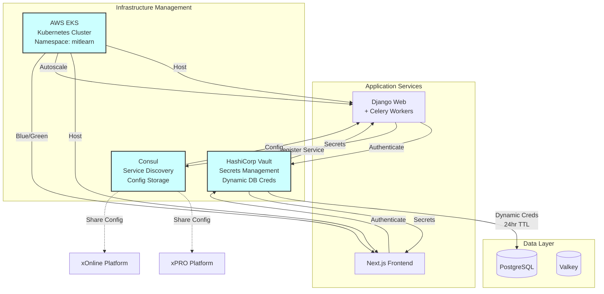

**Details:**
- **Vault:**
  - KV-v2 Mount: `secret-mitlearn`
  - AWS Backend: `aws-mitx`
  - Kubernetes Service Account Authentication
  - Database Roles: `app` (full access), `reverse-etl` (external schema)

- **Consul:**
  - Stores: `learn-api-domain`, `learn-frontend-domain`
  - Integrates with: MIT xPRO, MIT xOnline, MIT edX platforms

- **EKS:**
  - Namespace: `mitlearn`
  - Pod Security Groups enabled
  - HPA for web and celery workers

**Infrastructure Links:**
- Vault: [ol-infrastructure/.../mit_learn/__main__.py:392](https://github.com/mitodl/ol-infrastructure/blob/main/src/ol_infrastructure/applications/mit_learn/__main__.py#L392)
- Vault Policy: [ol-infrastructure/.../mit_learn/mitlearn_policy.hcl](https://github.com/mitodl/ol-infrastructure/blob/main/src/ol_infrastructure/applications/mit_learn/mitlearn_policy.hcl)
- Consul: [ol-infrastructure/.../mit_learn/__main__.py:1224](https://github.com/mitodl/ol-infrastructure/blob/main/src/ol_infrastructure/applications/mit_learn/__main__.py#L1224)
- EKS: [ol-infrastructure/.../mit_learn/__main__.py:95](https://github.com/mitodl/ol-infrastructure/blob/main/src/ol_infrastructure/applications/mit_learn/__main__.py#L95)
- K8s Secrets: [ol-infrastructure/.../mit_learn/k8s_secrets.py](https://github.com/mitodl/ol-infrastructure/blob/main/src/ol_infrastructure/applications/mit_learn/k8s_secrets.py)

---

## Environment-Specific Deployments

The infrastructure supports three environments:
- **CI:** Development/testing (deployed from `main` branch)
- **QA/RC:** Staging for pre-production testing (deployed from `release-candidate` branch)
- **Production:** Live environment (deployed from `release` branch with version tags)

Each environment has separate:
- Kubernetes deployments
- Database instances (RDS)
- Redis clusters (ElastiCache)
- OpenSearch domains
- S3 buckets (suffixed: `-ci`, `-rc`, `-production`)
- DNS records (production: `learn.mit.edu`, staging: `open.odl.local`)
- Fastly CDN configurations

---

## Key Infrastructure Links

### Primary Infrastructure Definitions
- **MIT Learn Backend (Pulumi)**: [ol-infrastructure/src/ol_infrastructure/applications/mit_learn/__main__.py](https://github.com/mitodl/ol-infrastructure/blob/main/src/ol_infrastructure/applications/mit_learn/__main__.py)
- **MIT Learn Next.js (Pulumi)**: [ol-infrastructure/src/ol_infrastructure/applications/mit_learn_nextjs/__main__.py](https://github.com/mitodl/ol-infrastructure/blob/main/src/ol_infrastructure/applications/mit_learn_nextjs/__main__.py)
- **OpenSearch Cluster (Pulumi)**: [ol-infrastructure/src/ol_infrastructure/infrastructure/aws/opensearch/__main__.py](https://github.com/mitodl/ol-infrastructure/blob/main/src/ol_infrastructure/infrastructure/aws/opensearch/__main__.py)
- **Kubernetes Secrets**: [ol-infrastructure/src/ol_infrastructure/applications/mit_learn/k8s_secrets.py](https://github.com/mitodl/ol-infrastructure/blob/main/src/ol_infrastructure/applications/mit_learn/k8s_secrets.py)
- **Backend Concourse Pipeline**: [ol-infrastructure/src/ol_concourse/pipelines/infrastructure/k8s_apps/docker_pulumi.py](https://github.com/mitodl/ol-infrastructure/blob/main/src/ol_concourse/pipelines/infrastructure/k8s_apps/docker_pulumi.py)
- **Pipeline Meta-Configuration**: [ol-infrastructure/src/ol_concourse/pipelines/infrastructure/k8s_apps/meta.py](https://github.com/mitodl/ol-infrastructure/blob/main/src/ol_concourse/pipelines/infrastructure/k8s_apps/meta.py)

### Local Development
- **Main Compose**: [docker-compose.yml](https://github.com/mitodl/mit-learn/blob/main/docker-compose.yml)
- **Services**: [docker-compose.services.yml](https://github.com/mitodl/mit-learn/blob/main/docker-compose.services.yml)
- **Applications**: [docker-compose.apps.yml](https://github.com/mitodl/mit-learn/blob/main/docker-compose.apps.yml)
- **OpenSearch**: [docker-compose.opensearch.single-node.yml](https://github.com/mitodl/mit-learn/blob/main/docker-compose.opensearch.single-node.yml)

---

## Traffic Flow Summary

1. **User Request** → Fastly CDN (TLS termination, caching, compression)
2. **Fastly** → Routes to:
   - Next.js Frontend (static/dynamic pages)
   - APISIX API Gateway (API requests)
3. **APISIX** → Authenticates via Keycloak (OIDC/OAuth2)
4. **APISIX** → Proxies to Nginx → Django
5. **Django** → Uses:
   - PostgreSQL (relational data)
   - Redis (caching + Celery message broker)
   - OpenSearch (full-text search)
   - Qdrant (vector similarity search)
   - S3 (file storage)
6. **Celery Workers** → Background processing:
   - **Default Queue:** General tasks (emails, cleanup)
   - **EDX Content Queue:** ETL from external sources
   - **Embeddings Queue:** AI vector generation

---

## Monitoring & Observability

- **Logs:** Vector Log Proxy aggregates from Fastly, APISIX, Nginx, Django
- **Errors:** Sentry (25% trace/profile sampling)
- **Analytics:** PostHog (user behavior tracking)
- **Metrics:** CloudWatch (AWS), Kubernetes metrics (KEDA)
- **Health Checks:**
  - `/health/startup/`: Database migrations, cache, Redis, DB connection
  - `/health/liveness/`: DB heartbeat
  - `/health/readiness/`: Cache, Redis, DB ready
  - `/health/full/`: All checks + Celery ping

---

## Security & Secrets

**Vault Secrets Management:**
- Database credentials (dynamic, 24hr TTL)
- API keys (OpenAI, YouTube, edX, Mailgun, etc.)
- OAuth client secrets
- TLS certificates

**Security Groups:**
- Application pods: K8s pod subnets ingress
- Database: App pods + Vault + Hightouch/Airbyte
- Redis: App pods + KEDA autoscaler

**Authentication:**
- Keycloak SSO (realm: `olapps`)
- OIDC/OAuth2 via APISIX
- JWT token-based API access
