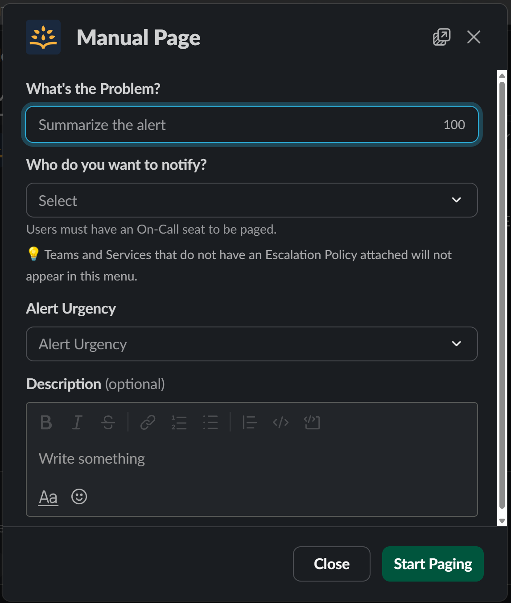

# Emergency Break Glass Procedure

In Slack, simply type:

```
/rootly page
```


At this point you'll be presented with a dialog that looks something like this:



Under "What's the Problem?" give a very short description of the issue.

Under "Who Do You Want To Notify?" choose the Platform Engineering Team in the dropdown.

Don't bother with the detailed Description, you'll want those details in the Slack channel or
Github issue.

Click "Start Paging" and that's it. You've successfully signalled an emergency and broken
glass.
