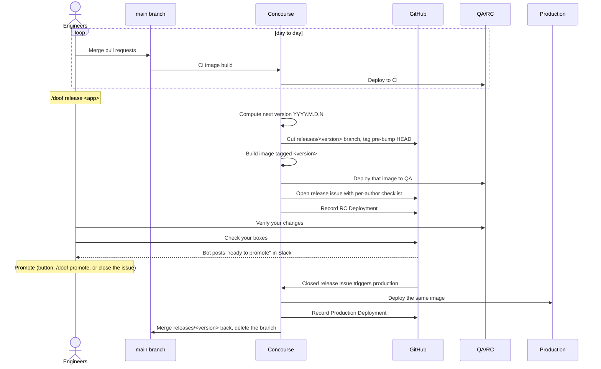

# Concourse Release Workflow

This is the release workflow that replaces Doof. An app on it is released from
Slack with `/doof`, verified through a GitHub issue checklist, and promoted to
production by closing that issue. There is no `release-candidate` branch and no
`release` branch: the same image that ran in QA is the image that runs in
production, and the release is identified by a calendar version tag.

Apps still on the legacy workflow are described in
[Webapp release process](webapp-release-process.md). Doof drives those until
they are migrated.

## Which workflow is my app on?

One field in `src/bridge/settings/apps.py` in `ol-infrastructure`
(`AppRegistration.release_resource_workflow`) decides this, and both the
Concourse pipeline generator and the release bot read it. That file is the
authoritative answer for any app.

If you run a `/doof` release command against an app that has not been migrated,
the bot refuses and says so. That refusal is deliberate: the jobs and artifacts
every command reaches for only exist in the new pipeline shape, so without it
the mutating commands would 404 in Concourse and the read-only ones would answer
confidently with the wrong version and the entire commit history.

## The shape of a release

Closing the release issue _is_ the promotion gate. The Slack button and
`/doof promote` are two ways of closing it; closing it by hand in GitHub works
just as well.

## Versions

Versions are calendar versions of the form `YYYY.M.D.N`, for example
`2026.9.3.1`: the first release on a day is `.1` and the counter resets the
next day. The month and day are _not_ zero padded, because `uv` and PEP 440
reject leading zeros.

The version tag is planted on the commit the release was cut from, before the
version bump. `action: finish` then lands two more commits on the default
branch, `Release <version>` and `Merge releases/<version>`. Both are excluded
from commit counts, checklists and changelog entries, so a finished release does
not propose its own bookkeeping as the next release's contents.

## Commands

All of these are subcommands of one slash command, and replies post visibly to
the channel rather than only to you.

| Command | What it does |
| --- | --- |
| `/doof release <app>` | Cuts a release: next version, release branch and tag, image build, QA deploy, release issue. |
| `/doof hotfix <app> <sha>` | Cuts what production runs plus one commit. See below. |
| `/doof preview <app>` | Shows what the next release would contain. Changes nothing. |
| `/doof release-notes <app>` | Lists the unreleased commits. |
| `/doof release-status [app]` | Reports release issue status, for one app or all of them. |
| `/doof wait-for-checkboxes <app>` | Watches a checklist and reports each author as they finish. |
| `/doof promote <app>` | Closes the release issue, which triggers the production deploy. |
| `/doof abandon <app>` | Tears down an in-flight release (branch and tag) and cancels a pending hotfix request. |
| `/doof publish <app>` | Not usable yet. No generated pipeline defines a `publish` job and no library is registered. |

## Verifying a release candidate

The release issue body is a task list grouped by author, generated from the
commits in the release. Verify your own changes in QA and check your boxes. When
every box is checked the bot posts a "ready to promote" message with a button
into the app's Slack channel, mentioning whoever ran `/doof release`.

Two things about that message are worth knowing. The authors in the checklist
are commit email addresses, not Slack users, so nobody is @-mentioned by the
checklist itself (Doof fuzzy-matched those names against the Slack directory).
And the `promote-ready` label the bot applies is bookkeeping to stop the
notification repeating, not a gate signal.

## Hotfixes

A hotfix is _production plus one commit_, not the default branch plus one
commit. The default branch usually carries unreleased work, so cherry-picking
onto its HEAD would either ship everything unreleased or fail on an empty
cherry-pick.

`/doof hotfix <app> <sha>` pushes a `hotfix/<full sha>` tag to the repo, which is
how the SHA reaches a Concourse job (triggering a job carries no parameters).
The next release check sees that tag and hands the build a hotfix instead of a
normal release. The tag is deleted as soon as the cut starts, whether or not it
succeeds, so a failed request cannot turn a later release into a hotfix.

It refuses, rather than guessing, when:

- another release is in flight (promote or abandon it first),
- GitHub cannot confirm that the last release actually deployed to production,
- the commit is already contained in production.

While a hotfix request is pending, `/doof release` and `/doof preview` refuse
too, because a release cut at that moment would cut the hotfix instead.

## In-flight releases, superseding, and abandoning

A release is "in flight" when its `releases/<version>` branch still exists on
the remote, which means it was cut but never finished. That is a statement about
git, not about deployment: a release whose production deploy succeeded but whose
merge-back failed is still in flight by this definition.

`/doof release` on an app with an in-flight release _supersedes_ it: the old
release branch is deleted, and its tag with it if that release never reached
production. A release that did reach production keeps its tag, because the tag is
the only thing tying what production runs back to a commit. Doof refused a second
release instead. The change is deliberate: pinning to the in-flight version froze
the resource indefinitely after a single failed merge-back.

`/doof abandon <app>` deletes the in-flight release's branch and tag and cancels
any pending hotfix request. Use it when a release was cut and must not ship.

## What is actually running in production

A closed release issue means _promotion was authorized_, not that production is
running that version. What production is running is recorded as a GitHub
Deployment on the `Production` environment of the app's repo, and the bot posts
a message when an RC or Production deployment reaches success.

## Differences from Doof worth knowing

- Invocation changed. Doof was `@doof <command>` in a channel bound to a project.
  This bot is `/doof <subcommand> <app>` from anywhere, with the app named.
- `preview` and `abandon` are new. `hotfix` was rebuilt on the new machinery.
- Doof's `version`, `hash`, `what needs review`, `start new releases` and
  `uptime` have no equivalent yet.
- Doof narrated the whole lifecycle in Slack. This bot posts a ready-to-promote
  message, RC and production deployment milestones, and a nag when a release has
  sat cut-but-unfinished for 24 hours. Rollout narration comes from kubewatch,
  routed by the `ol.mit.edu/slack-channel` pod label rather than by the release.
- The release PR state labels Doof maintained (`WAITING_FOR_CHECKBOXES` and the
  rest) are gone. The release issue carries only `release` and `promote-ready`.

## When something looks stuck

- The release job binds a version when the build is scheduled, so a build
  triggered without a fresh resource check reuses the previous version. The bot
  always forces that check and refuses to trigger if it fails; if you trigger
  `build-<app>-release-image` by hand in Concourse, check the `<app>-release`
  resource first.
- A release cut but not finished for more than 24 hours gets a Slack nag. Read it
  as a real signal: it usually means the merge-back failed.
- The production deploy waits on the `<app>-release-gate` resource noticing the
  closed issue. `/doof promote` and the Slack button force that check; closing
  the issue by hand leaves the deploy waiting for the resource's normal poll.

For how the machinery underneath works, see
[Release workflow machinery](../../../platform_services/ci_cd/release_workflow_machinery.md).
