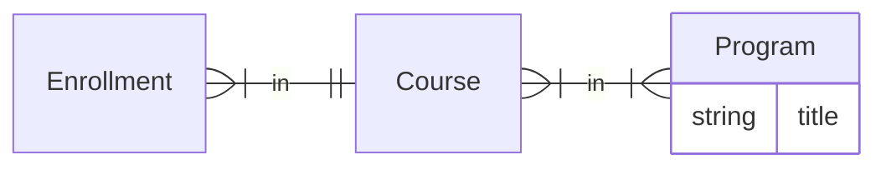

# Write Performant APIs

A fast API is really two problems: the shape of the response you return, and the cost of the queries
that fill it. This guide covers both, in that order.

/// admonition | The short version
    type: tip

- Keep response nesting to two levels or less; split deeper data into a second endpoint.
- Paginate every list endpoint, cap the client-supplied page size, and order deterministically.
- Narrow the pagination `count` query to the primary key; it is a second query over your whole
  result set.
- Pick the narrowest prefetch tool that works - `select_related()` for foreign keys,
  `prefetch_related()` for to-many relationships, `prefetch()` for data the model has no direct
  relationship to.
- Declare `required_prefetches` on every serializer so a missing prefetch fails loudly.
- Back a prefetch with a same-named `cached_property` so non-API callers get the same answer.
- Test list APIs with 5-10 records at each level, or the N+1 checks won't fire.
///

## Shape the response

### Keep nesting to two levels

As a rule of thumb, an API shouldn't return an object structure deeper than two levels. If you find
yourself needing more depth, that's a signal consumers should be making a subsequent call to another
API instead.

**Avoid this:**

`GET /api/enrollments/`
```json
[{
    "id": 1,
    "course": {
        "id": 234,
        "topics": [{
            "name": "Chemistry"
        }]
    }
}, {
    "id":2,
    "course": {
        "id": 62,
        "topics": [{
            "name": "Physics"
        }]
    }
}]
```

Two things go wrong here:

- More deeply nested responses are increasingly difficult to write optimized queries for.
- Data is duplicated in-memory on the clients, resulting in a larger runtime footprint and worse
  performance.

**Do this instead** - normalize the data and split it across two calls:

`GET /api/enrollments/`
```json
[{
    "id": 1,
    "course_id": 234
}, ...]
```

`GET /api/courses/?id=234,62`
```json
[{
    "id": 62,
    "topics": [{
        "name": "Physics"
    }]
}, {
    "id": 234,
    "topics": [{
        "name": "Chemistry"
    }]

}]
```

/// admonition | Trade-off: one extra round trip
    type: info

The client makes an extra network request, and gets two things back:

- A much faster initial request, because it's loading less data.
- A cacheable second request - the results from `/api/courses/?id=234,62` may in fact already be
  loaded and not need to be requested at all.
///

### Paginate every list endpoint

Every list endpoint must be paginated. An unpaginated endpoint is a latency and memory cliff that
grows with your data - it passes review, passes tests, passes RC, and then falls over in production
when the table it reads is an order of magnitude larger. "This table is small" is a statement about
today, not about the endpoint.

#### Set one default and opt out explicitly

Define pagination once in a shared module rather than per app. Before
[mit-learn#3106](https://github.com/mitodl/mit-learn/pull/3106), an identical `DefaultPagination`
had been copy-pasted into several apps' `views.py`, so there was no single place to fix any of this.
Consolidating to two implementations was half the point of that change:

```python
# main/pagination.py
from rest_framework.pagination import LimitOffsetPagination


class DefaultPagination(LimitOffsetPagination):
    """Default pagination class for rest APIs"""

    count_fields = ("pk",)

    default_limit = 10
    max_limit = 100

    def get_count(self, queryset):
        """Get the count of objects in the queryset"""
        # we additionally filter this down to a subset of fields
        return queryset.only(*self.count_fields).count()


class LargePagination(DefaultPagination):
    """Large pagination for small resources, e.g., topics."""

    default_limit = 1000
    max_limit = 1000
```

`max_limit` is not optional. Without it, `?limit=100000` defeats the pagination you just configured.

Make it the framework default so a new viewset is paginated without opting in:

```python
REST_FRAMEWORK = {
    "DEFAULT_PAGINATION_CLASS": "main.pagination.DefaultPagination",
}
```

With that set, delete the per-viewset `pagination_class = DefaultPagination` lines - they're now
redundant. Views that genuinely must return an unpaginated list opt out **explicitly**, which keeps
the exemption visible in review instead of implied by an absent setting:

```python
class UserSearchSubscriptionViewSet(mixins.ListModelMixin, viewsets.GenericViewSet):
    pagination_class = None  # unpaginated by design; preserves the existing interface
```

#### Pick the right pagination class

| Class | Use it for | Watch out for |
| --- | --- | --- |
| `LimitOffsetPagination` | The default for most list APIs | Deep offsets get slower; computes `count` |
| `PageNumberPagination` | APIs whose clients think in page numbers | Same as above |
| `CursorPagination` | Large or append-heavy tables, feeds, exports | Requires a stable indexed `ordering`; no random access to page N |

`LIMIT/OFFSET` does not skip rows for free - Postgres still walks and discards everything before the
offset, so page 500 costs far more than page 1. `CursorPagination` instead filters on an indexed
ordering column, so every page costs the same, and it omits `count` entirely.

/// admonition | Order deterministically or pages will lie
    type: warning

Pagination on a non-deterministic ordering silently duplicates and skips records across pages,
because the database is free to return equal-ranked rows in any order. Always order on something
unique, or append a unique tiebreaker:

```python
queryset = Enrollment.objects.order_by("-created_on", "id")
```
///

#### Keep the count query cheap

/// admonition | `count` is a second query over your whole result set
    type: danger

DRF's paginated response includes a `count`, which it computes as a separate `SELECT COUNT(*)`
wrapping your queryset. That is cheap for a plain filter and expensive once the query carries
aggregations or wide joins - and the cost scales with production data, not with your fixtures.

This is not hypothetical: it is the proximate cause of the
[2026-03-24 MIT Learn outage](../../runbooks_post_mortems/20260324_mitlearn_outage.md), where moving
an aggregation into the main query was fine locally and on RC, then exhausted the production
database's temp space and storage under real ordinality.
///

DRF's default `get_count()` is just `queryset.count()`. When the queryset is `DISTINCT` and carries
annotations, that count wraps a subquery selecting **every** column the page would have selected -
including the joins and aggregates that exist only to produce them. Counting rows needs none of that.
For `/api/v1/featured/` the count query looked like this:

```sql
SELECT COUNT(*)
FROM (
  SELECT DISTINCT "learningresource"."id" AS "col1",
    "learningresource"."created_on" AS "col2",
    -- ... 37 more columns ...
    COUNT("learningresourceviewevent"."id") AS "_views_count",
    "learningresourcerelationship"."position" AS "position"
  FROM "learningresource"
  LEFT OUTER JOIN "learningresourceviewevent" ON (...)
  INNER JOIN "learningresourcerelationship" ON (...)
  WHERE (...)
)
```

Narrowing the count to the primary key - the `get_count()` override in `DefaultPagination` above -
reduces it to this, dropping the view-event join and its aggregate entirely:

```sql
SELECT COUNT(*)
FROM (
  SELECT DISTINCT "learningresource"."id" AS "col1",
    "learningresourcerelationship"."position" AS "position"
  FROM "learningresource"
  INNER JOIN "learningresourcerelationship" ON (...)
  WHERE (...)
) subquery;
```

**On that endpoint the count went from ~500ms to ~0.3ms.** Don't expect ~1000x everywhere - the win
is that the count stops going to disk for data it never needed and can often be served from indexes
alone.

/// admonition | Widen `count_fields` when `DISTINCT` is doing real work
    type: warning

`count_fields` is a class attribute precisely so it can be overridden. Narrowing to `pk` preserves
the count when the `DISTINCT` already includes a unique column, because the row count can't change.

If a queryset is `DISTINCT` over *non-unique* columns specifically to collapse duplicate rows, then
dropping columns changes what "distinct" means and therefore changes the count. Subclass and widen
`count_fields` to include the columns the distinctness depends on.
///

If you need an aggregate in the response, prefer computing it outside the paginated queryset, or use
`CursorPagination`, which doesn't count at all.

## Load the data efficiently

### Pick the right prefetch tool

| Tool | Use it for | Cost |
| --- | --- | --- |
| `select_related(...)` | Foreign key relationships only | Joins onto the main query |
| `prefetch_related(...)` | One-to-many and many-to-many relationships | A separate query per relationship |
| `prefetch(...)` | Nested data the model has no direct relationship to | A separate query per prefetcher |

### `select_related()` vs `prefetch_related()`

It is possible to overuse `select_related()` to the point that you're actually harming performance -
too much data and too many joins will slow down the main query. It's best to profile the difference.

**When in doubt, reach for `prefetch_related()`** - splitting the work into a separate query is the
safer default.

### `prefetch()` for indirect relationships

`prefetch()` extends Django's prefetching capabilities via the
[`django-prefetch`](https://pypi.org/project/django-prefetch/) library. A prefetcher is good to reach
for when you need to fetch data that the base model does not directly depend on.

#### The data model

An enrollment relates to a course, and a course to programs - but an enrollment has no direct
relationship to a program:



#### Writing a prefetcher

To return the titles of the programs an enrollment is in without returning the entire tree, define a
`Prefetcher` with these hooks:

| Hook | Returns | Purpose |
| --- | --- | --- |
| `collect` | `bool` | When `True`, groups the base objects by the return value of `mapper()` |
| `mapper(obj)` | A key | The value on the base object to match on |
| `filter(ids)` | A `QuerySet` | One query fetching everything for the collected keys |
| `reverse_mapper(related)` | Key(s) | Maps a related object back to the base-object keys it belongs to |
| `decorator(obj, related)` | `None` | Attaches the result to the base object |

```python
from django.contrib.postgres.aggregates import ArrayAgg
from prefetch import Prefetcher, PrefetchManagerMixin, PrefetchQuerySet

class ProgramTitlesPrefetcher(Prefetcher):
    collect = True

    def mapper(self, enrollment):
        return enrollment.course_id

    def filter(self, ids):
        if not ids:
            return Program.objects.none()
        # one query to fetch everything
        return Program.objects.filter(
            course__id__in=ids
        ).annotate(
            # postgres-specific aggregation
            course_ids=ArrayAgg("course__id")
        ).only("title")  # only the fields we will use

    def reverse_mapper(self, program):
        return program.course_ids

    def decorator(self, enrollment, programs=None):
        enrollment.program_titles = [program.title for program in programs] if programs else []

# NOTE: this is named mixin, but it's actually a subclass of models.Manager
class EnrollmentManager(PrefetchManagerMixin):
    prefetch_definitions = {
        "program_titles": ProgramTitlesPrefetcher
    }

class Enrollment(models.Model):

    objects = EnrollmentManager()


# Now you can do this and it will only perform 2 queries
Enrollment.objects.prefetch("program_titles")
```

/// admonition | Two footguns
    type: danger

- **Return an explicit empty queryset when there are no ids.** Otherwise you risk weird edge cases
  where `filter()` returns the entire table.
- **Handle the `None` case in `decorator()`.** Its related argument is either `None` (nothing
  matched) or the list of matches, so always provide a default value.
///

#### Custom `QuerySet`s

`PrefetchManagerMixin` hardcodes `get_queryset_class` to return `PrefetchQuerySet`, so a custom
`QuerySet` needs a little extra configuration:

```python
class EnrollmentQuerySet(QuerySet, PrefetchQuerySet): ...

class EnrollmentManager(PrefetchManagerMixin):

    ...

    def get_queryset_class(self):
        return EnrollmentQuerySet
```

### Make one property work with and without a prefetch

Prefetching only happens on the path that built the queryset for it. The same derived data is usually
also wanted from a celery task, a management command, the admin, or a shell session - none of which
went through your API's queryset. You don't want two implementations of "the programs this enrollment
is in" that can drift apart.

`cached_property` and a prefetcher can share one attribute, because **`cached_property` is a non-data
descriptor**: it defines `__get__` but not `__set__`, so a matching entry in the instance's `__dict__`
takes precedence and the property body never runs. `decorator()` sets a plain instance attribute,
which lands in exactly that `__dict__`. Give the `cached_property` the same name as the prefetch and
the two compose with no extra wiring:

```python
from django.utils.functional import cached_property

class Enrollment(models.Model):
    objects = EnrollmentManager()

    @cached_property
    def program_titles(self) -> list[str]:
        # Fallback. Only runs when prefetch("program_titles") did not populate
        # this instance, i.e. outside the API path.
        return list(
            Program.objects.for_course_ids([self.course_id]).values_list("title", flat=True)
        )
```

- `Enrollment.objects.prefetch("program_titles")` - `decorator()` fills `__dict__`, so
  `enrollment.program_titles` is already there and the property is never evaluated.
- `Enrollment.objects.get(pk=1)` - nothing filled `__dict__`, so the property runs and queries for
  that one enrollment, then caches the result on the instance.

Callers read `enrollment.program_titles` either way and never need to know which happened.

#### Keep the two paths querying the same thing

The pattern is only safe if both paths mean the same thing by the data. Put the predicate in one
queryset method and have both call it, rather than writing the filter twice:

```python
class ProgramQuerySet(models.QuerySet):
    def for_course_ids(self, course_ids):
        if not course_ids:
            return self.none()
        return self.filter(course__id__in=course_ids)

class Program(models.Model):
    objects = ProgramQuerySet.as_manager()
```

The prefetcher's `filter()` calls `Program.objects.for_course_ids(ids)` for every collected course id
at once; the `cached_property` calls it with a single id. One definition of the relationship, two
batching strategies - so a change to the predicate can't apply to only one of them.

/// admonition | The fallback is the N+1 you were avoiding
    type: warning

Per-object querying is exactly what prefetching exists to prevent. That's an acceptable trade in a
celery task walking a handful of records, and unacceptable in a list API.

The danger is that the fallback is *silent* - a missing prefetch doesn't raise, it just quietly
issues one query per row. That is precisely why serializers declare
[`required_prefetches`](#require-prefetches-in-serializers): it turns the silent N+1 back into a loud
failure on the path where it matters.
///

/// admonition | Not needed for `prefetch_related()`
    type: info

This pattern is for `prefetch()` and `Prefetcher.decorator()`, which assign instance attributes.
`select_related()` and `prefetch_related()` populate Django's own relation caches, and accessing
`enrollment.course` or `.topics.all()` already uses those caches transparently when they're warm and
queries when they aren't. Don't wrap those in a `cached_property`.
///

### Require prefetches in serializers

Subclass `mitol.common.serializers.BaseSerializer` and define `required_prefetches`. If you don't
define it, a `RequiredPrefetchesNotDefinedError` is raised on serializer init:

```python
from mitol.common.serializers import BaseSerializer

class EnrollmentSerializer(BaseSerializer):
    required_prefetches: list[str] = [
        "program_titles"
    ]
```

This ensures the serializer can't be used without that prefetch having been done - otherwise it
raises a `RequiredPrefetchMissingError` naming the prefetch that wasn't requested. A "prefetch" in
this situation is anything that should be `prefetch()`, `prefetch_related()`, or `select_related()`.

/// admonition | The escape hatch is not for API code
    type: danger

Tests and async code such as celery tasks can opt out by passing
`{"skip_prefetch_checks": THIS_IS_NOT_AN_API}`. As the name (and you) attests to, this should not be
used _anywhere_ near an API - including when other serializers call it, since DRF propagates the
context into child serializers as well.
///

## Test it

### Give N+1 checks enough data

Projects are set up with N+1 checks on tests. To ensure these checks can detect problems, make sure
you test APIs with data of enough ordinality.

For a list API, create 5-10 records at each level of the response. Taking `/api/courses/?id=234,62`
from above, that means creating several courses and then several topics per course. If you use a
lower count, the quantity may not exceed the N+1 checker's detection thresholds.

## Resources

- [Django: `select_related()`](https://docs.djangoproject.com/en/stable/ref/models/querysets/#select-related)
- [Django: `prefetch_related()`](https://docs.djangoproject.com/en/stable/ref/models/querysets/#prefetch-related)
- [Django: `Prefetch` objects](https://docs.djangoproject.com/en/stable/ref/models/querysets/#prefetch-objects)
- [Django: `cached_property`](https://docs.djangoproject.com/en/stable/ref/utils/#django.utils.functional.cached_property)
- [DRF: Pagination](https://www.django-rest-framework.org/api-guide/pagination/)
- [mit-learn#3106: Query for less data on pagination count](https://github.com/mitodl/mit-learn/pull/3106)
- [`django-prefetch`](https://pypi.org/project/django-prefetch/)
- [2026-03-24 MIT Learn outage post-mortem](../../runbooks_post_mortems/20260324_mitlearn_outage.md)
