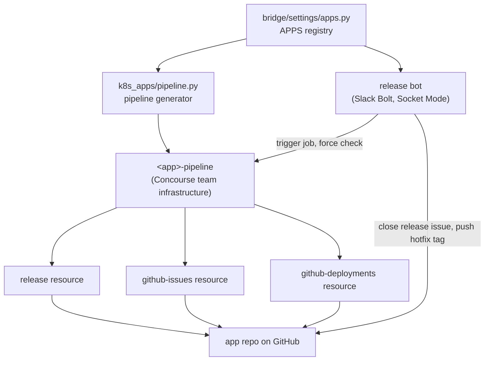

# Release Workflow Machinery

This describes how the modernized release workflow is built: the custom
Concourse resources, the generated pipeline, the app registry, and the Slack
bot. For how to use it as an engineer releasing an app, see
[Concourse release workflow](../../handbook/delivering/release-process/concourse-release-workflow.md).
For migrating an app onto it, see
[Migrating an app to the release workflow](migrating_an_app_to_the_release_workflow.md).

Background: RFC [mitodl/hq#10465](https://github.com/mitodl/hq/discussions/10465)
and epic [mitodl/hq#7185](https://github.com/mitodl/hq/issues/7185).

## Why it exists

Doof (`mitodl/release-script`, the Heroku app `odl-release-bot`) polled
`/static/hash.txt` to tell what was deployed and drove `release-candidate` and
`release` branches. Neither survives the move to Kubernetes: the same image is
promoted from RC to production, so a separate release branch describes nothing,
and the hash endpoint is not a deployment record.

The replacement keeps the part of the old process people relied on, a checklist
that the authors of a release tick off, and moves the rest onto git refs, GitHub
Deployments, and Concourse resources.

## The pieces

### Custom Concourse resources

All three live in `mitodl/ol-concourse` under `resources/`, are written with
[concoursetools](https://concoursetools.readthedocs.io/), and authenticate as
the same GitHub App.

`release` (`resources/release`, image `mitodl/concourse-release-resource`) owns
the whole git side of a release:

- `check` compares the tracked branch's HEAD to the newest `YYYY.M.D.N` tag and
  emits the next version plus `head_sha`, `since`, `commit_count`, `authors`,
  `in_flight` and `hotfix`. `head_sha` binds the later `in` and `out` steps to
  the commit that was evaluated, so commits landing mid-build do not change what
  is released.
- `in` writes `version`, `in_flight`, `hotfix`, `commits.json`, `checklist.md`
  (the issue body, grouped by author) and `changelog_entry.md`.
- `out action: create` cuts `releases/<version>`, commits the version bump, and
  tags the pre-bump HEAD. `action: finish` merges that branch back into the
  default branch and deletes it. `action: abandon` tears a cut release down.

`github-issues` opens the release issue from `body_file` and, configured with
`issue_state: closed` and `skip_if_labeled: [abandoned]`, acts as the production
gate. `github-deployments` records the RC and Production GitHub Deployments.

The resource's own reference documentation, covering the source fields and the
hotfix contract, is in
[`resources/release/README.md`](https://github.com/mitodl/ol-concourse/blob/main/resources/release/README.md).

### The app registry

`src/bridge/settings/apps.py` in `ol-infrastructure` is the single registry of
repo, default branch, Slack channel and workflow opt-in. The pipeline generator
and the bot both read it, so an app cannot be migrated in one control surface and
not the other. `release_workflow_repos()` also decides which repos get the
release bot's bypass on their required-status-checks ruleset, in
`src/ol_infrastructure/saas/github/repositories/rulesets.py`. The org-level
bypass is separate: it is granted to the App for every tier-1 default branch in
`saas/github/organization/org_rulesets.py`, regardless of the registry.

### The generated pipeline

`_build_release_resource_app_pipeline` in
`src/ol_concourse/pipelines/infrastructure/k8s_apps/pipeline.py` emits the
pipeline; `build_app_pipeline` dispatches to it or to the legacy builder based on
the registry. Pipelines are named `<app>-pipeline` and live in the Concourse team
`infrastructure`.

Jobs:

| Job | Trigger | What it does |
| --- | --- | --- |
| `build-<app>-image-from-<branch>` | Push to the default branch | Builds and pushes the CI image (`latest` plus git short ref). |
| `deploy-ol-application-<app>-ci` | New CI image | Pulumi deploy to CI. |
| `build-<app>-release-image` | The `<app>-release` resource | Bumps the version, `put action: create`, checks out the cut release, builds the image tagged with the version. |
| `deploy-ol-application-<app>-qa` | New release image | Pulumi deploy to QA, then opens the release issue from `checklist.md` and marks the RC Deployment successful. |
| `deploy-ol-application-<app>-production` | `<app>-release-gate` (a closed release issue) | Pulumi deploy to production, then marks the Production Deployment successful and runs `put action: finish`. |
| `abandon-<app>-release` | Manual, or `/doof abandon` | `put action: abandon`: deletes the release branch and tag. |

The image is built from the cut `releases/<version>` branch rather than from the
main-branch checkout, because a hotfix is production plus one commit and the
main-branch checkout does not hold that tree.

### The Slack bot

`src/ol_infrastructure/applications/release_bot/` is an async Slack Bolt app on
Socket Mode, deployed by its own Pulumi project into the `operations` namespace
of the `applications.Production` EKS cluster. It is a thin adapter over the
machinery above: `/doof release` forces a resource check then triggers a job,
`/doof promote` closes an issue then forces the gate resource to check.

Its background loops:

- ready-to-promote, every 120s: an open release issue whose checklist is fully
  checked gets a Slack message with a promote button, deduped with the
  `promote-ready` label. An app with neither a `slack_channel` in the registry nor
  the `RELEASE_ANNOUNCE_CHANNEL` fallback is skipped entirely.
- release progress, every 120s: announces RC and Production deployments as they
  reach success, and nags every 24h about a release that has been cut but not
  finished for longer than `RELEASE_STUCK_AFTER_HOURS` (default 24).

It reads its app list from `REPOS_CONFIG`, a JSON blob rendered from the registry
at Pulumi apply time, and talks to Concourse's REST API with the same
resource-owner password grant `fly login` uses, scoped to the team named in
`CONCOURSE_TEAM` (`infrastructure`).

## Invariants and traps

These are the things that have actually broken, and the reasons the code looks
the way it does.

The `<app>-release` resource is `check_every: never` with no webhook.
Triggering `build-<app>-release-image` without forcing a check first makes the
job bind whatever version Concourse last recorded, so the new release reuses the
previous release's version number _and_ its commit list. Anything that triggers
that job programmatically must force the check and refuse to proceed if it fails.

Never wrap the `action: finish` put in a `try`. It used to be, to tolerate a
re-triggered production job finding the release branch already gone. The resource
now no-ops in that case, so the `try` bought nothing and swallowed genuine
failures: an app sat for weeks with an unmerged release branch, and therefore a
frozen release version, with no red build anywhere to show for it.

Writes to a mitodl default branch are governed by org-level GitHub _rulesets_,
not classic branch protection, and each ruleset carries its own bypass actor
list. `ol-release-bot` (App id 4437866) holds an `always` bypass on the org rulesets
covering tier-1 default branches, and on the required-status-checks ruleset of
each repo in the app registry.
Without that, `action: finish` fails with `GH013: Repository rule violations
found`. Doof was unaffected only because its `odlbot` identity inherits the
`odl-engineering-owners` team bypass.

The shared credential is named `github_app`, not `github`. Every Concourse team
already has a team-scoped `github` secret, and Concourse's Vault credential
manager tries team-scoped paths before the shared fallback, so a credential named
`github` silently resolves to the wrong secret. It is backed by
`secret-concourse/shared/github_app` and referenced as
`((github_app.release_bot_app_id))` and friends.

The bot runs a single replica on purpose. Socket Mode holds one persistent
WebSocket per app-level token; a second replica opens a competing connection and
Slack distributes events non-deterministically between them, silently dropping
interactions. Its module-level state (the in-process checklist watchers, the
per-app locks, the map of who requested each release) is only safe because of
that. Scaling out needs leader election or a move to the HTTP Events API.

`ol_concourse` is a namespace package. The meta job puts the ol-infrastructure
checkout's `src` on `PYTHONPATH`, so `ol_concourse.pipelines` resolves to the
checkout while `ol_concourse.lib.tasks` (where `bump_version_task` lives)
resolves to the package installed in the `mitodl/ol-infrastructure` image. A
change to a task in `ol-concourse` only reaches generated pipelines after that
image is rebuilt, which happens in an image-build pipeline in Concourse team
`main` (`ol-infrastructure-docker-container` at the time of writing), not in the
app pipelines.

Concourse is split across two teams. `<app>-pipeline` and the infrastructure meta
pipelines live in `infrastructure`; the image builds and the library publish meta
pipelines live in `main`. A `fly` command aimed at the wrong team 404s silently
rather than erroring usefully.

## Supported by the resource, not wired up in pipelines

Two things the machinery can do are not enabled anywhere, so do not read their
presence as working behavior.

`/doof publish` triggers a Concourse job named `publish`. No generated pipeline
defines one, and no library is registered in the app registry, so library
releases (RFC phase 3) do not run through this workflow yet.

Changelog management is implemented in the release resource (`changelog_style`,
either a cumulative `CHANGELOG.md` or a file per release) but no pipeline sets
it, so no changelog is written or committed as part of a release.
